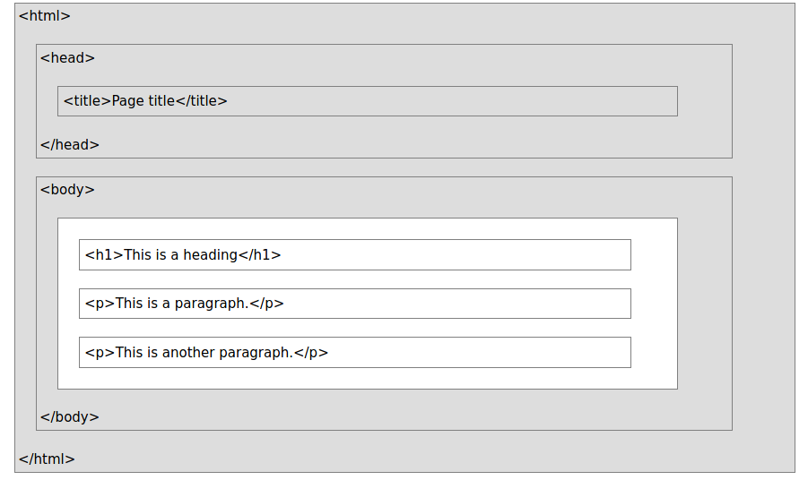
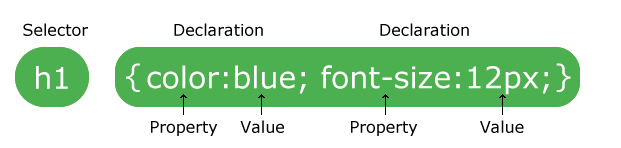

# Web Development Learning Path

## Road Map


1. What a Website Is ?
    - Websites are files stored on servers, which are computers that host (fancy term for “store files for”) websites. These servers are connected to a giant network called the internet.

2. What an IP Address Is ?
    - Internet Protocol is a set of standards that govern interaction on the internet.
    - To access a website, you need to know its IP address. An IP address is a unique string of numbers. Each device has an IP address to distinguish itself from the billions of websites and devices connected via the internet.

3. What HTTP Means ?
    - HyperText Transfer Protocol (HTTP) connects you and your website request to the remote server that houses all website data. It’s a set of rules (a protocol) that defines how messages should be sent over the internet. It allows you to jump between site pages and websites.

4. What Front-end Means ?
    - Front-end (or client-side) is the side of a website or software that you see and interact with as an internet user. When website information is transferred from a server to a browser, front-end coding languages allow the website to function without having to continually “communicate” with the internet.

5. What Back-end Means ?
    - Back-end (or server-side) is the side that you don’t see when you use the internet. It’s the digital infrastructure, and to non-developers, it looks like a bunch of numbers, letters, and symbols.

Now we can see Road Map for Front-end development.

### Front-end Development Roadmap


1. HTML
2. CSS
3. Framework(optional but important)
    1. Bootstrap
    2. MaterializeCSS
    3. Semantic
    4. Foundation
4. Javascript
5. Framework(optional but important)
    1. Vue js
    2. ReactJS
    3. Angular

### Back-end Development Roadmap


1. Database Knowledge
2. Back-end Programming Language
    1. Python
    2. PHP
    3. Ruby
    4. Javascript(Node) etc ...

3. Framework( optional but important )
    1. Django
    2. Laravel
    3. Ruby on Rails
    4. ExpressJs

## What is HTML ?

HTML stands for Hyper Text Markup Language.

HTML is the standard markup language for Web pages

HTML elements are the building blocks of HTML pages

HTML elements are represented by <> tags.

### HTML Elements

An HTML element is a start tag and an end tag with content in between:

```html
<h1>This is a Heading</h1>
```

### HTML Attributes

- HTML elements can have attributes
- Attributes provide additional information about the element
- Attributes come in name/value pairs like charset="utf-8"

### Simple Example

```html
<!DOCTYPE html>
<html lang="en">

<meta charset="utf-8">
<title>Page Title</title>

<body>
   <h1>This is a Heading</h1>
   <p>This is a paragraph.</p>
   <p>This is another paragraph.</p>
</body>

</html>
```

***Example Explained***

HTML elements are the building blocks of HTML pages.

- The `<!DOCTYPE html>` declaration defines this document to be HTML5

- The `<html>` element is the root element of an HTML page
- The `lang` attribute  defines the language of the document
- The `<meta>` element contains meta information about the document
- The `charset` attribute defines the character set used in the document
- The `<title>` element specifies a title for the document
- The `<body>` element contains the visible page content
- The `<h1>` element defines a large heading
- The `<p>` element defines a paragraph



### Basic HTML Elements

1. HTML Headings
    - HTML headings are defined with the `<h1> to <h6>` tags
    - `<h1>` defines the most important heading. `<h6>` defines the least important heading.

    ```html
    <h1>This is heading 1</h1>
    <h2>This is heading 2</h2>
    <h3>This is heading 3</h3> 
    <h4>This is heading 4</h4> 
    <h5>This is heading 5</h5> 
    <h6>This is heading 6</h6> 
    ```

2. HTML Paragraphs
    - HTML paragraphs are defined with the `<p>` tag

    ```html
     <p>This is a paragraph.</p>
     <p>This is another paragraph.</p> 
    ```

3. HTML Links
    - HTML links are defined with the `<a>` tag.

    ```html
     <a href="https://www.w3schools.com">This is a link</a> 
     ```

    - The link's destination is specified in the href attribute.
    - Attributes are used to provide additional information about HTML elements.

4. HTML Images
    - HTML images are defined with the `` tag.
    - The source file (src), alternative text `(alt), width, and height` are provided as attributes.

    ```html
      
    ```

### HTML Forms

- An HTML form is used to collect user input. The user input is most often sent to a server for processing.

1. The `<form>` Element
    - The HTML `<form>` element is used to create an HTML form for user input

    ```html
    <form>
    form elements
    </form>
    ```

    - The  `<form>` element is a container for different types of input elements, such as: text fields, checkboxes, radio buttons, submit buttons, etc.

2. The `<input>` Element
    - The HTML `<input>` element is the most used form element.
    - An `<input>` element can be displayed in many ways, depending on the type attribute.

    | Type      | Description |
    | :---        |    :----:   |
    | `<input type="text">`      | Displays a single-line text input field       |
    | `<input type="radio">`   | Displays a radio button (for selecting one of many choices)|
    | `<input type="checkbox">`   | Displays a checkbox (for selecting zero or more of many choices))|
    | `<input type="submit">`   | Displays a submit button (for submitting the form)|
    | `<input type="button">`   | Displays a clickable button |

3. The `<select>` Element
    - The `<select>` element defines a drop-down list.

    ```html
     <label for="cars">Choose a car:</label>
    <select id="cars" name="cars">
    <option value="volvo">Volvo</option>
    <option value="saab">Saab</option>
    <option value="fiat">Fiat</option>
    <option value="audi">Audi</option>
    </select> 
    ```

    - The `<option>` elements defines an option that can be selected.
    - By default, the first item in the drop-down list is selected.
    - To define a pre-selected option, add the selected attribute to the option
    `<option value="value" selected>Text</option>`
    - Allow Multiple Selections
    - Use the multiple attribute to allow the user to select more than one value.
    `<select ... multiple>`
    - resource for reference [W3School](https://www.w3schools.com/html/html_form_input_types.asp)

## CSS

- CSS is the language we use to style an HTML document.

- CSS describes how HTML elements should be displayed.

- CSS is the language we use to style a Web page.

- CSS stands for Cascading Style Sheets

### Why Use CSS ?

- CSS is used to define styles for your web pages, including the design, layout and variations in display for different devices and screen sizes.

#### CSS Solved a Big Problem

- HTML was NEVER intended to contain tags for formatting a web page!
- HTML was created to describe the content of a web page, like:

    ```html
    <h1>This is a heading</h1>

    <p>This is a paragraph.</p>
    ```

#### CSS Saves a Lot of Work

The style definitions are normally saved in external .css files.

With an external stylesheet file, you can change the look of an entire website by changing just one file.

### CSS Syntax

- A CSS rule consists of a selector and a declaration block.



- The selector points to the HTML element you want to style.
- The declaration block contains one or more declarations separated by semicolons.
- Each declaration includes a CSS property name and a value, separated by a colon.
- Multiple CSS declarations are separated with semicolons, and declaration blocks are surrounded by curly braces.

    ```css
    p {
    color: red;
    text-align: center;
    }
    ```

#### Explanation

- p is a selector in CSS (it points to the HTML element you want to style: `<p>`).
- `color` is a property, and `red` is the property value.
- `text-align` is a property, and `center` is the property value.

### CSS Selectors

- CSS selectors are used to "find" (or select) the HTML elements you want to style.
- We can divide CSS selectors into five categories:
    1. Simple selectors (id, name )
    2. Combinator selectors ( class )
    3. Pseudo-class selectors (certain state link, hover)
    4. Pseudo-elements selectors ( certain element first-letter, odd, even )
    5. Attribute selectors

### The CSS element Selector

- The element selector selects HTML elements based on the element name.

    ```css
    p {
    text-align: center;
    color: red;
    }
    ```

### The CSS id Selector

- The id selector uses the id attribute of an HTML element to select a specific element.
- The id of an element is unique within a page, so the id selector is used to select one unique element!
- To select an element with a specific id, write a hash (#) character, followed by the id of the element.

    ```css
        <!-- CSS -->
        #para1 {
        text-align: center;
        color: red;
        }

        <!-- HTML -->
        <p id="param1" > this is paragraph </p>
    ```

- An id name cannot start with a number.

### The CSS class Selector

- The class selector selects HTML elements with a specific class attribute.
- To select elements with a specific class, write a period (.) character, followed by the class name.

    ```css
        <!-- CSS -->
        .center {
        text-align: center;
        color: red;
        }

        <!-- HTML -->
        <p class="center"> this is the element </p>
    ```

- You can also specify that only specific HTML elements should be affected by a class.

    ```css
        <!-- CSS -->
        p.center {
        text-align: center;
        color: red;
        }

        <!-- HTML -->
        <p class="center"> this is the element </p>
    ```

- HTML elements can also refer to more than one class.

### The CSS Universal Selector

- The universal selector (*) selects all HTML elements on the page.

    ```css
        * {
        text-align: center;
        color: blue;
        }
    ```

### The CSS Grouping Selector

- The grouping selector selects all the HTML elements with the same style definitions.
- To group selectors, separate each selector with a comma.

    ```css
     h1, h2, p {
    text-align: center;
    color: red;
    }
    ```

### Adding CSS To HTML and the order

- Three Ways to Insert CSS
    1. External CSS
    2. Internal CSS
    3. Inline CSS

### CSS Comments

- `/* This is a single-line comment */`

Let's Code !!!
